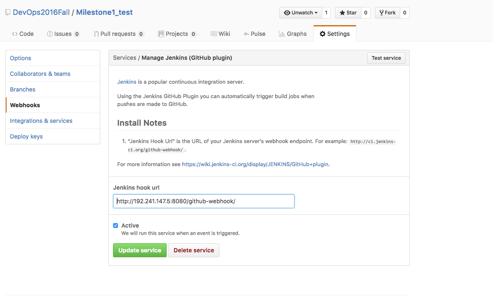
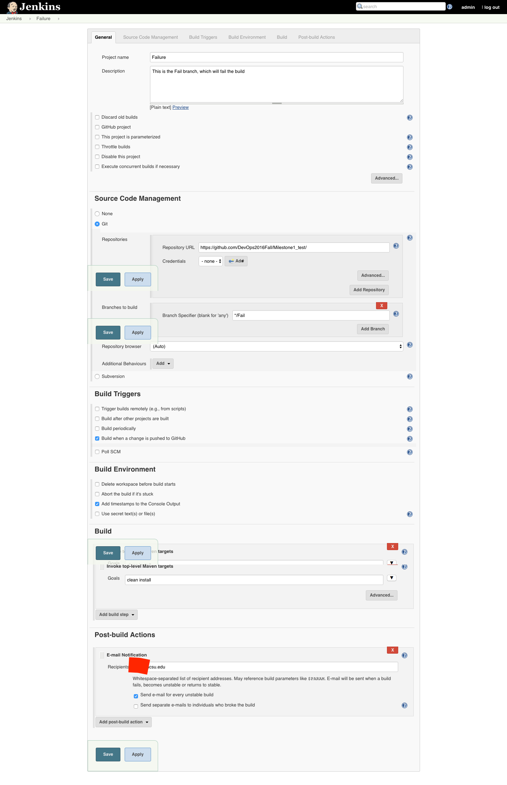
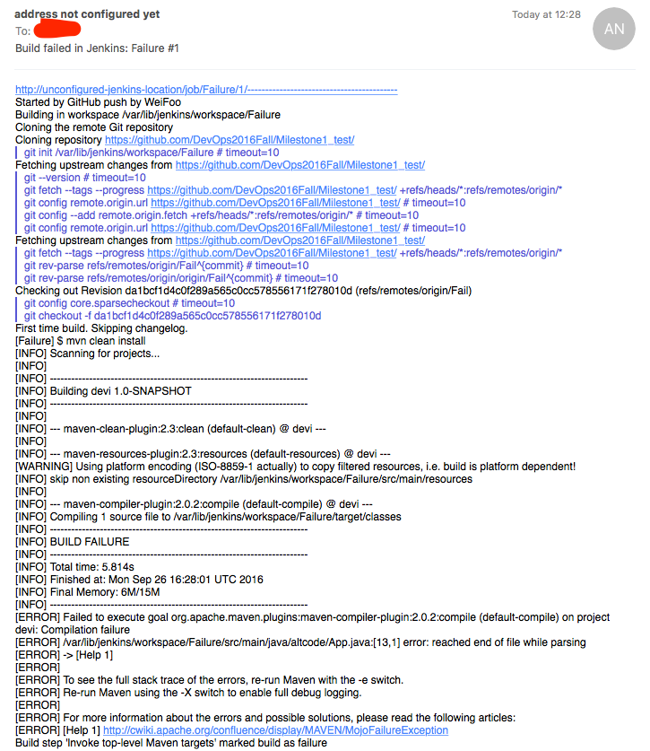

# Build

## Automatically Provision Build Server

In this section, we will automatically provision a build server on DigitalOcean by using the techniques learned from preivious workshops and homeworks. Prerequisites

```
 Git, Node, ansible, DigitalOcean account
```


### Steps
* By running ```node provision.js```, we get a build server on DigitalOcean for Jenkins. Store the IP auch as ```192.241.147.5``` into an ansible ```inventory``` file
* Install ```Ansible role```[Jenkins CI](https://galaxy.ansible.com/detail#/role/440) by 

 ```
 ansible-galaxy install geerlingguy.Jenkins 
 ```
* Write a playbook, which will install Jenkins, git and maven on the server

 ```
---
- hosts: node0
  roles:
      - { role: geerlingguy.Jenkins }
  tasks:
  - name: Install git
    apt: name=git state=latest

  - name: install maven (and other packages if needed)
    become: yes
    apt: pkg={{ item }} state=latest update_cache=yes cache_valid_time=3600
    with_items:
      - maven
``` 
* Install Jenkins by ```ansible-playbook -i inventory Jenkins.yml```

* Now Jenkins is automatically installed on the build server, visit ```192.241.147.5:8080```

* Tools that used during build, like Git and Maven, are also installed automatically.

## Github Configurations
Since we want the project to be build everytime a new push commited to the repo, we need to have webhook to automatically trigger build jobs. In Github, we can easily configure this by the following steps.

### Steps

* Go to the [DevOps2016Fall/Milestone1_test](https://github.com/DevOps2016Fall/Milestone1_test) repo GitHub __Settings__
* __Integrations & Service__:__Add Service__
* select__Jenkins (GitHub plugin)__ 
* Enter Jenkins Hook URL as  

 ```
 http://192.241.147.5:8080/github-webhook/
 ```
 
 
## DigitalOcean Email Server
When the build is failed, we have to send emails to notify the developer. In this project, we setup a send-only email server on DigitalOcean according to this [link](https://www.digitalocean.com/community/tutorials/how-to-install-and-configure-postfix-as-a-send-only-smtp-server-on-ubuntu-14-04)

### Steps

* ```sudo apt-get install mailutils```
* Select __Internet Site__ option, Press ENTER to install
* Configure Postfix: Change the line that reads inet_interfaces = all to inet_interfaces = loopback-only
* sudo service postfix restart
* Test: 

	```
echo "This is the body of the email" | mail -s "This is the subject line" user@example.com
```

## Jenkins

After the build server is automatically provisioned, we can login the Jenkins homepage by visiting```192.241.147.5:8080``` and using ``Jenkins`admin``` for both user name and passwords. Before we run our build jobs, we have to configure Jenkins by the following steps.

### Steps

* Install plugins on Jenkins:
  - github
  - mailer
  - other recommended plugins
* Configurations:
  - pass(since git and maven are installed automatically by ansible)
* Create two Jobs
  - Go to Jenkins homepage, select __New Item__ --> enter __Success__ as the job name--> __Freestyle project__
  - __General__ --> enter Project name __https://github.com/DevOps2016Fall/Milestone1_test__
  - Select __Git__ -->enter Repo URL
  * __Branch Specifier__--> enter one branche name: __*/master__ (There are two branches, master and fail, created previously on github test repo)
  * __Build Triggers__ --> select __Build when a change is pushed to GitHub__
  * __Build__--> select__Invoke top-level Maven targets__ and enter__clean isntall__ in the Goals
  * __Post-build Actions__ --> select __E-mail Notification__ and enter __***@ncsu.edu__ as the recipients and check __Send e-mail for every unstable build__(every failed build will triger sending email)
  * Repeat the whole process to create another job called __Failure__ which will be trigerred when __*/Fail__ branch is commited.
  
  

## Testing
* Run ```node jenkins.js``` to automatically provision a server on DigitalOcean.
* Run ```ansible-playbook -i inventory Jenkins.yml ``` to install jenkins, java-jdk, git and maven on the server.
* Clone [Test repo](https://github.com/DevOps2016Fall/Milestone1_test/).
* Checkout to master/Fail branch.
* Make changes to the java file.
* Commit and push this change to the github.
* Go to Jenkins to track this build job by checking console output.
* If commits to master branch, the Success build job will run. This build will be successful(by design), then you can see somthing like

	```
16:32:50 [INFO] BUILD SUCCESS
16:32:50 [INFO] ------------------------------------------------------------------------
16:32:50 [INFO] Total time: 9.984s
16:32:50 [INFO] Finished at: Mon Sep 26 16:32:50 UTC 2016
16:32:50 [INFO] Final Memory: 13M/32M
16:32:50 [INFO] ------------------------------------------------------------------------
16:32:50 Finished: SUCCESS
```
* If commits to Fail branch, the Fail build job will run and a notification email will be sending since this build fails. It can be found in your inbox (probaly in junk box)
* You can also browser previous builds logs in the build history section.



## Demo
* [Demo1](https://youtu.be/eXOqyXVl7wY): Build Server Testing
* [Demo2](https://youtu.be/dvgAMV8Sfmg): Automatically Provision Build Server + Build Server Testing


  
  
  

