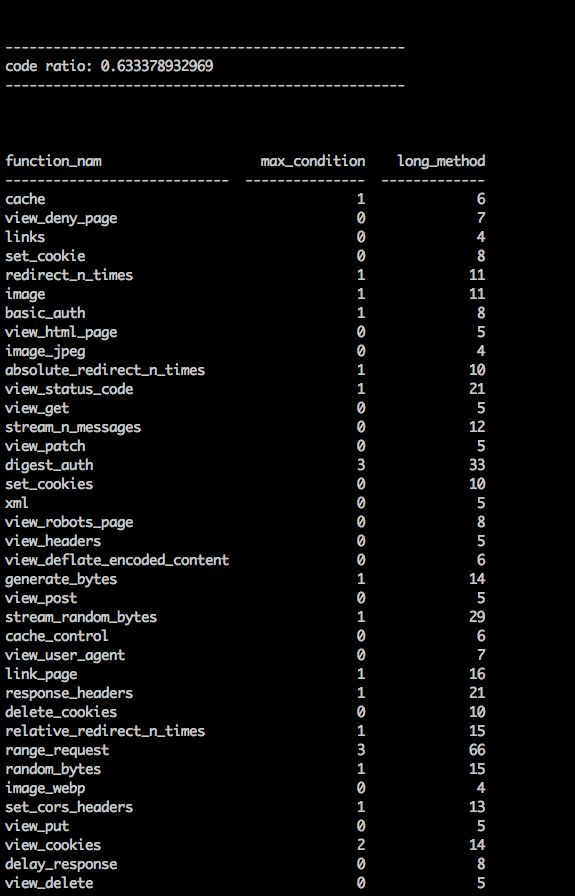

# Test + Analysis

## Set Up

* Using the tools we got from last milestone, we can easily provision a build server with Jenkins and DigitalOcean
* run ```node provision_jenkins.js``` to create a droplet
* run ```ansible-playbook -i inventory jenkins.yml``` to install ```jenkins``` and all the dependencies
* The open source project that we selected to test is [httpbin](https://github.com/DevOps2016Fall/httpbin), which is a python package.

## Test Suites [__Youtube Demo1__](https://youtu.be/ZfN7bAJeLUw)
 

We use the following packages and plugins to implement unit tests and display results

* nose: unitest for python code.
* coverage: compute coverage for python code.
* pylint: statical code analysis for python code.
* Junit Plugin: display the unit test results generated from nose.
* Cobertura Plugin: display the coverage analysis from coverage.
* Violations Plugin: display the statical analysis results from pylint.

 


## Advanced Testing:test case generation [__Youtube Demo2__](https://youtu.be/V5HjZjyE45A)

Based on the project [httpbin](https://github.com/DevOps2016Fall/httpbin) test cases, we implement a test case generator using ast module in python called[test_generator.py](https://github.com/DevOps2016Fall/Milestone2/blob/master/Jenkins/test_generator.py), which will read the source code ```core.py``` and generate a test case based on default parameters of each function. We can see that our converage is improved from 70% to 77%.
 

## Basic Analysis [__Youtube Demo3__](https://youtu.be/2j1D0FH_RfU)
We used ```pylint``` which is a statical analysis tool for python language. we get the following results.


## Custom Metrics: [__Youtube Demo4__](https://youtu.be/9i5lgEcYZdE)
We write a python [script](https://github.com/DevOps2016Fall/Milestone2/blob/master/Jenkins/metrics.py) to compute the max_condition, long_method, and the code ratio three different meetrics. 



## Gates:[__Youtube Demo5__](https://youtu.be/4GqE5WcCfBQ)

We have a [post_script](https://github.com/DevOps2016Fall/Milestone2/blob/master/Jenkins/gate.sh) to check whether the code coverage is greater than 70% and the convention violation counts are less than 200. If so, then accept this commit and push the new code to a branch tagged ```test```. Otherwise reject the commit and don't push the new code.

### accept a commit and push to test tag

```
[workspace] $ /usr/bin/env bash /tmp/hudson6354407320936899037.sh
Pushing HEAD to branch test at repo origin
 > git --version # timeout=10
 > git push git@github.com:DevOps2016Fall/httpbin.git HEAD:test
[WS-CLEANUP] Deleting project workspace...[WS-CLEANUP] done
Finished: SUCCESS
```


### reject a commit 

```
[workspace] $ /usr/bin/env bash /tmp/hudson4213563813100809818.sh
Average code coverate is less than  0.70 .
Commit Failed!
Build step 'Execute a set of scripts' changed build result to FAILURE
Build step 'Execute a set of scripts' marked build as failure
Build did not succeed and the project is configured to only push after a successful build, so no pushing will occur.
[WS-CLEANUP] Deleting project workspace...[WS-CLEANUP] done
Finished: FAILURE
```


  
  
  

