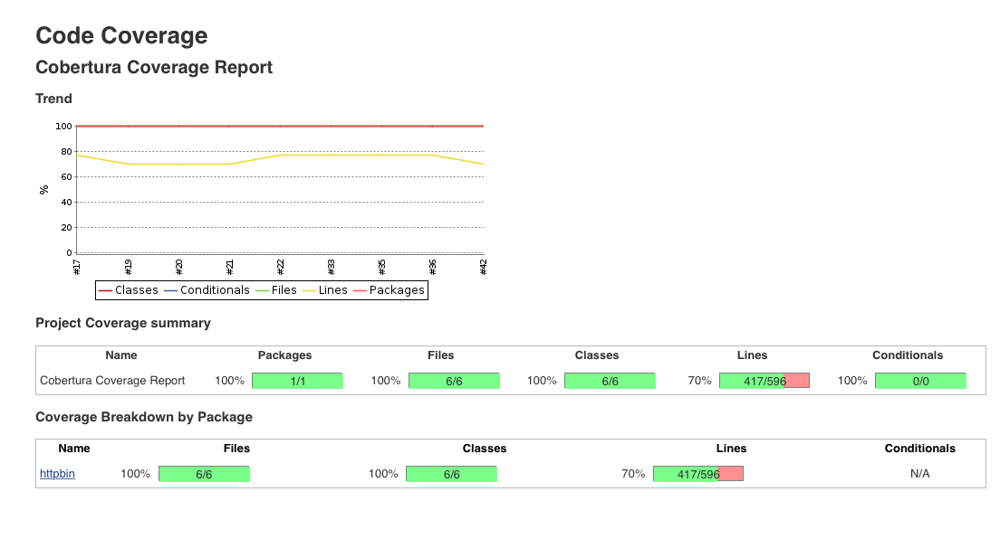
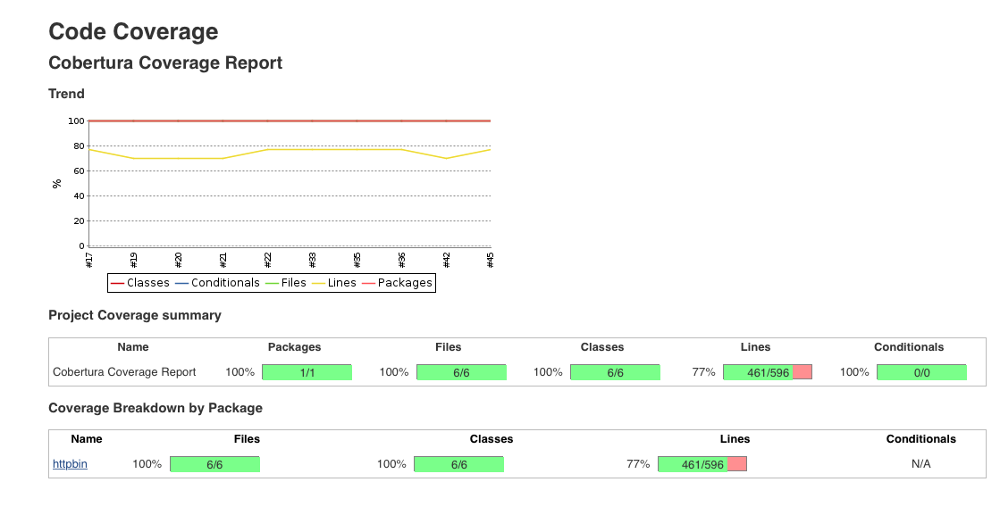
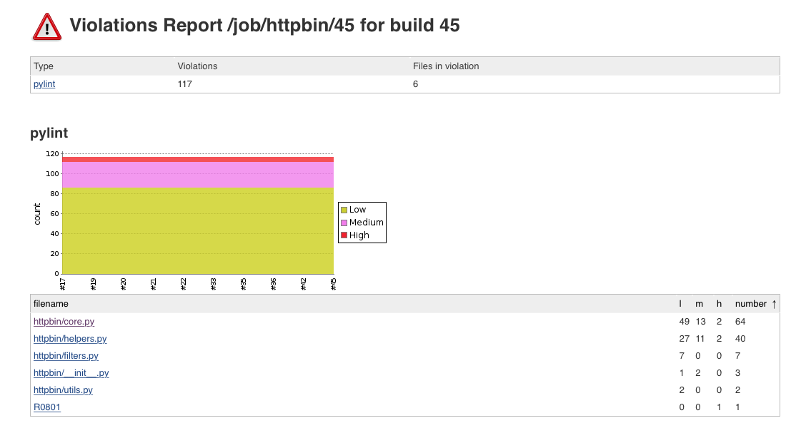

# Test + Analysis

## Set Up

* Using the tools we got from last milestone, we can easily provision a build server with Jenkins and DigitalOcean
* run ```node provision_jenkins.js``` to create a droplet
* run ```ansible-playbook -i inventory jenkins.yml``` to install ```jenkins``` and all the dependencies
* The open source project that we selected to test is [httpbin](https://github.com/DevOps2016Fall/httpbin), which is a python package.

## Test Suites [__Youtube Demo1__](https://youtu.be/ZfN7bAJeLUw)
 

We use the following packages and plugins to implement unit tests and display results

* nose: unitest for python code.
* coverage: compute coverage for python code.
* pylint: statical code analysis for python code.
* Junit Plugin: display the unit test results generated from nose.
* Cobertura Plugin: display the coverage analysis from coverage.
* Violations Plugin: display the statical analysis results from pylint.

 


## Advanced Testing:test case generation [__Youtube Demo2__](https://youtu.be/V5HjZjyE45A)

Based on the project [httpbin](https://github.com/DevOps2016Fall/httpbin) test cases, we implement a test case generator using ast module in python called[test_generator.py](https://github.com/DevOps2016Fall/Milestone2/blob/master/Jenkins/test_generator.py), which will read the source code ```core.py``` and generate a test case based on default parameters of each function. We can see that our converage is improved from 70% to 77%.
 

## Basic Analysis [__Youtube Demo3__](https://youtu.be/2j1D0FH_RfU)
We used ```pylint``` which is a statical analysis tool for python language. we get the following results.


## Custom Metrics: [__Youtube Demo4__](https://youtu.be/9i5lgEcYZdE)
We write a python [script](https://github.com/DevOps2016Fall/Milestone2/blob/master/Jenkins/metrics.py) to compute the __max_condition__, __long_method__, and the __code ratio__ three different meetrics. 

```


--------------------------------------------------
code ratio: 0.633378932969
--------------------------------------------------


function_nam                    max_condition    long_method
----------------------------  ---------------  -------------
cache                                       1              6
view_deny_page                              0              7
links                                       0              4
set_cookie                                  0              8
redirect_n_times                            1             11
image                                       1             11
basic_auth                                  1              8
view_html_page                              0              5
image_jpeg                                  0              4
absolute_redirect_n_times                   1             10
view_status_code                            1             21
view_get                                    0              5
stream_n_messages                           0             12
view_patch                                  0              5
digest_auth                                 3             33
set_cookies                                 0             10
xml                                         0              5
view_robots_page                            0              8
view_headers                                0              5
view_deflate_encoded_content                0              6
generate_bytes                              1             14
view_post                                   0              5
stream_random_bytes                         1             29
cache_control                               0              6
view_user_agent                             0              7
link_page                                   1             16
response_headers                            1             21
delete_cookies                              0             10
relative_redirect_n_times                   1             15
range_request                               3             66
random_bytes                                1             15
image_webp                                  0              4
set_cors_headers                            1             13
view_put                                    0              5
view_cookies                                2             14
delay_response                              0              8
view_delete                                 0              5
view_gzip_encoded_content                   0              6
view_origin                                 0              5
hidden_basic_auth                           1              7
resource                                    0              5
image_svg                                   0              4
redirect_to                                 1             18
_redirect                                   0              2
jsonify                                     1              5
drip                                        1             26
generate_stream                             0              2
encoding                                    0              3
digest_auth_md5                             0              3
view_landing_page                           0              5
view_forms_post                             0              5
image_png                                   0              4
decode_base64                               0              5
```


## __BONUS__:[__Youtube Demo__](https://youtu.be/KoeTx6OJf8M)

The [duplicate detector]() is implemented based on [open source](https://github.com/PidgeyL/DCD)

```
Weis-MacBook-Air:httpbin WeiFu$ python duplicate.py -f httpbin
No duplicates found in /__init__.py
Duplicate found in /core.py
377/389 -     cookies = dict(request.args.items())
378/390 -     r = app.make_response(redirect(url_for('view_cookies')))
379/391 -     for key, value in cookies.items():

Duplicate found in /core.py
530/547 -     n = min(n, 100 * 1024) # set 100KB limit
532/549 -     params = CaseInsensitiveDict(request.args.items())
533/550 -     if 'seed' in params:
534/551 -         random.seed(int(params['seed']))

Duplicate found in /core.py
553/588 -     if 'chunk_size' in params:
554/589 -         chunk_size = max(1, int(params['chunk_size']))
555/590 -     else:
556/591 -         chunk_size = 10 * 1024


Duplicate found in /filters.py
40/72 -     data = f(*args, **kwargs)
42/74 -     if isinstance(data, Response):
43/75 -         content = data.data
44/76 -     else:
45/77 -         content = data


No duplicates found in /helpers.py
No duplicates found in /structures.py
No duplicates found in /utils.py
```

## Gates:[__Youtube Demo5__](https://youtu.be/4GqE5WcCfBQ)

We have a [post_script](https://github.com/DevOps2016Fall/Milestone2/blob/master/Jenkins/gate.sh) to check whether the code coverage is greater than 70% and the convention violation counts are less than 200. If so, then accept this commit and push the new code to a branch tagged ```test```. Otherwise reject the commit and don't push the new code.

### accept a commit and push to test tag

```
[workspace] $ /usr/bin/env bash /tmp/hudson6354407320936899037.sh
Pushing HEAD to branch test at repo origin
 > git --version # timeout=10
 > git push git@github.com:DevOps2016Fall/httpbin.git HEAD:test
[WS-CLEANUP] Deleting project workspace...[WS-CLEANUP] done
Finished: SUCCESS
```


### reject a commit 

```
[workspace] $ /usr/bin/env bash /tmp/hudson4213563813100809818.sh
Average code coverate is less than  0.70 .
Commit Failed!
Build step 'Execute a set of scripts' changed build result to FAILURE
Build step 'Execute a set of scripts' marked build as failure
Build did not succeed and the project is configured to only push after a successful build, so no pushing will occur.
[WS-CLEANUP] Deleting project workspace...[WS-CLEANUP] done
Finished: FAILURE
```


  
  
  

