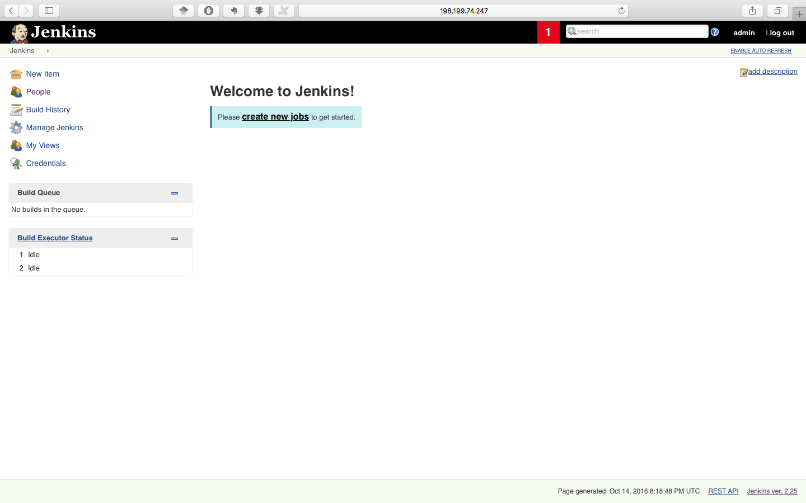

# Build

## Automatically Provision Build Server(This is the same as Milestone1)

In this section, we will automatically provision a build server on DigitalOcean by using the techniques learned from preivious workshops and homeworks. Prerequisites

```
 Git, Node, ansible, DigitalOcean account
```


### Steps
* By running ```node provision.js```, we get a build server on DigitalOcean for Jenkins. Store the IP auch as ```198.199.74.247``` into an ansible ```inventory``` file

* Install Jenkins, git and all python dependencies on the build server by ```ansible-playbook -i inventory Jenkins.yml``` The following packages will be installed
 
 ```
 ---
system_packages:
  - build-essential
  - git
  - python-dev
  - python-setuptools
  - maven
python_packages:
  - pip
python_pip_packages:
  - mock
  - nose
  - coverage
  - pylint
 
 ```

* Now Jenkins is automatically installed on the build server, visit ```198.199.74.247:8080```

* Tools that used during build, like Git and Maven, are also installed automatically.

* Go to the [DevOps2016Fall/Milestone2_test](https://github.com/DevOps2016Fall/Milestone2_test) repo GitHub __Settings__ and enter Jenkins Hook URL as  

 ```
 http://198.199.74.247:8080/github-webhook/
 ```
* Install plugins on Jenkins:
  - github
  - Junit: display nose test reports
  - Cobertura: display python code coverage
  - Violations：display python code format, like 
* Configurations:
  - pass(since git and maven are installed automatically by ansible)
* Create two Jobs
  - Go to Jenkins homepage, select __New Item__ --> enter __Success__ as the job name--> __Freestyle project__
  - __General__ --> enter Project name __https://github.com/DevOps2016Fall/Milestone1_test__
  - Select __Git__ -->enter Repo URL
  * __Branch Specifier__--> enter one branche name: __*/master__ (There are two branches, master and fail, created previously on github test repo)
  * __Build Triggers__ --> select __Build when a change is pushed to GitHub__
  * __Build__--> select__Invoke top-level Maven targets__ and enter__clean isntall__ in the Goals
  * __Post-build Actions__ --> select __E-mail Notification__ and enter __***@ncsu.edu__ as the recipients and check __Send e-mail for every unstable build__(every failed build will triger sending email)
  * Repeat the whole process to create another job called __Failure__ which will be trigerred when __*/Fail__ branch is commited.
  
  

## Testing
* Run ```node jenkins.js``` to automatically provision a server on DigitalOcean.
* Run ```ansible-playbook -i inventory Jenkins.yml ``` to install jenkins, java-jdk, git and maven on the server.
* Clone [Test repo](https://github.com/DevOps2016Fall/Milestone1_test/).
* Checkout to master/Fail branch.
* Make changes to the java file.
* Commit and push this change to the github.
* Go to Jenkins to track this build job by checking console output.
* If commits to master branch, the Success build job will run. This build will be successful(by design), then you can see somthing like

	```
16:32:50 [INFO] BUILD SUCCESS
16:32:50 [INFO] ------------------------------------------------------------------------
16:32:50 [INFO] Total time: 9.984s
16:32:50 [INFO] Finished at: Mon Sep 26 16:32:50 UTC 2016
16:32:50 [INFO] Final Memory: 13M/32M
16:32:50 [INFO] ------------------------------------------------------------------------
16:32:50 Finished: SUCCESS
```
* If commits to Fail branch, the Fail build job will run and a notification email will be sending since this build fails. It can be found in your inbox (probaly in junk box)
* You can also browser previous builds logs in the build history section.


## Demo
* [Demo1](https://youtu.be/eXOqyXVl7wY): Build Server Testing
* [Demo2](https://youtu.be/dvgAMV8Sfmg): Automatically Provision Build Server + Build Server Testing


  
  
  

